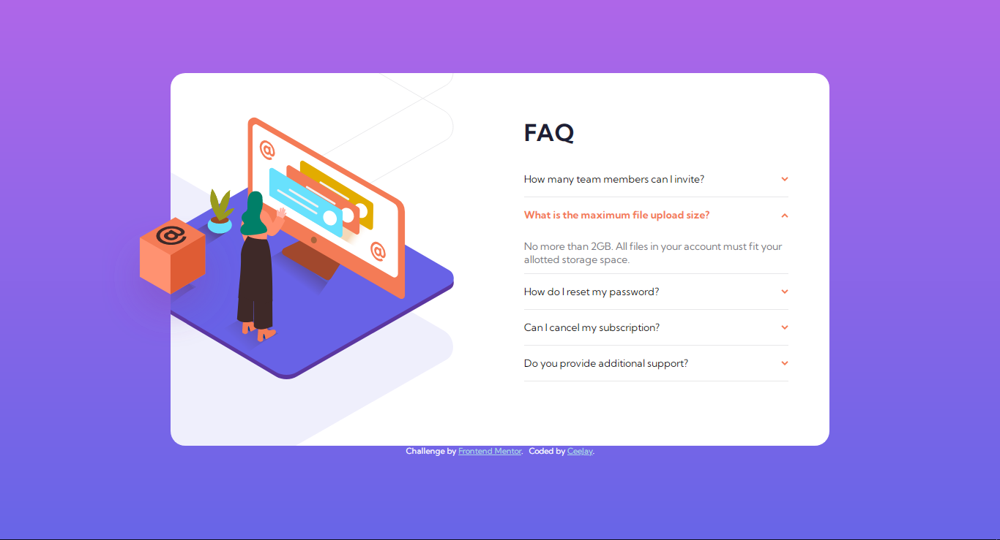

# Frontend Mentor - FAQ accordion card solution

This is a solution to the [FAQ accordion card challenge on Frontend Mentor](https://www.frontendmentor.io/challenges/faq-accordion-card-XlyjD0Oam). Frontend Mentor challenges help you improve your coding skills by building realistic projects. 

## Table of contents

- [Overview](#overview)
  - [The challenge](#the-challenge)
  - [Screenshot](#screenshot)
  - [Links](#links)
- [My process](#my-process)
  - [Built with](#built-with)
  - [What I learned](#what-i-learned)
  - [Continued development](#continued-development)
  - [Useful resources](#useful-resources)
- [Author](#author)

## Overview

### The challenge

Users should be able to:

- View the optimal layout for the component depending on their device's screen size
- See hover states for all interactive elements on the page
- Hide/Show the answer to a question when the question is clicked

### Screenshot

### Links

- Solution URL: [Solution](https://github.com/Ceejay-777/Faq-accordion-card)
- Live Site URL: [Live Site](https://ceejay-777.github.io/Faq-accordion-card/)

## My process

### Built with

- Semantic HTML5 markup
- CSS custom properties
- Flexbox
- Mobile-first workflow
- jQuery Framework [jQuery site](https://learn.jquery.com/)

### What I learned

- First of all, this challenge was a great was for me to practice my CSS and JavaScript/jQuery. 

- I learned loads and loads about manipulating CSS to produce the effect I want and also about making sure tha my design was accessible and looked great across various devices. 

- Being new to jQueery and infact JavaScript, I had issues with building the accordion from scratch and making sure each other questions close up when a question is clicked. However, everything worked out fine and it was excellent practice. I feel now that I understand jQuery much better and can't wait to use it much more. 

### Continued development

- CSS layouts: Going forward, it would be really cool to have a good understanding of CSS layouts (flex, grid, table e.t.c) since I have been doing a whole lot of trial and error. I just don't know if this knowledge would come if I solve more challenges or I should go after that intentionally. Probably the latter though.

- jQuery: I've sincerely fallen in love with this framework and can't wait to tear it inside out.

### Useful resources

- [StackOverflow](https://stackoverflow.com/) - I love the way I can find answers to precise questions here (and even more than one answer) rather than a solution to the whole challenge which seems a bit like cheating.
- [CSS Tricks](https://css-tricks.com/) - They have a lot of fast and concise answers to many questions in CSS. 
- [jQuery Website](https://learn.jquery.com/) - Reading jQuery documentaion here is superb. Well-written and comprehensive.

## Author

- Frontend Mentor - [@Ceejay-777](https://www.frontendmentor.io/profile/Ceejay-777)
- Twitter - [@Cee_Jay_777](https://www.twitter.com/Cee_Jay_777)

